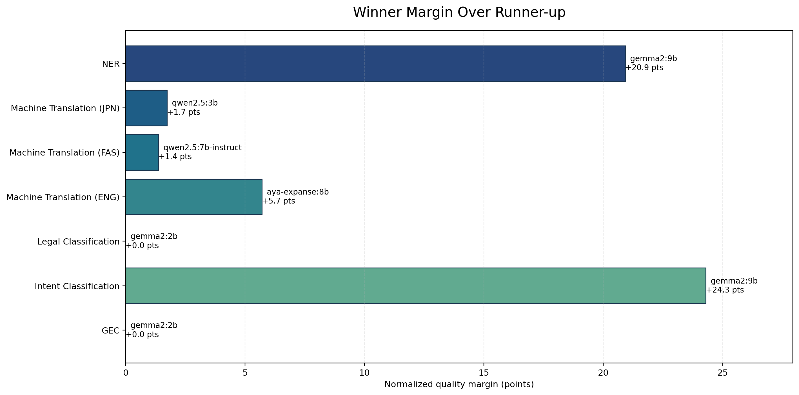
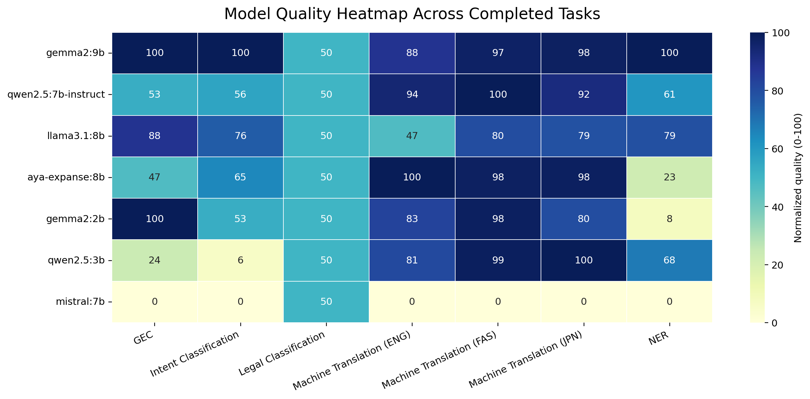
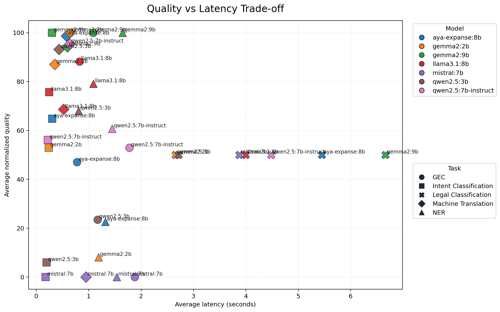

# Full Benchmark Report

This report summarizes the completed March 25, 2026 full-suite run captured in `results/full_benchmark_suite/`.

## Run Status

- Completed tasks: `gec`, `intent_classification`, `legal_classification`, `machine_translation`, `ner`
- Incomplete tasks: `pos`, `summarization`
- Failure point: `pos` crashed in the dataset parser with `ValueError: invalid literal for int() with base 10: '_'`.

## Overall Model Ranking

| rank | model | tasks_completed | avg_normalized_quality | median_normalized_quality | avg_latency_seconds |
| --- | --- | --- | --- | --- | --- |
| 1 | gemma2:9b | 7 | 90.405 | 97.701 | 1.639 |
| 2 | qwen2.5:7b-instruct | 7 | 72.284 | 60.685 | 1.406 |
| 3 | llama3.1:8b | 7 | 71.273 | 78.736 | 1.103 |
| 4 | aya-expanse:8b | 7 | 68.634 | 64.816 | 1.366 |
| 5 | gemma2:2b | 7 | 67.456 | 79.885 | 0.827 |
| 6 | qwen2.5:3b | 7 | 61.017 | 68.006 | 0.883 |
| 7 | mistral:7b | 7 | 7.143 | 0.000 | 1.473 |

## Best Model Per Task Segment

| task_segment | primary_metric | winner | winner_value | winner_quality_score | runner_up | runner_up_value | runner_up_quality_score | quality_margin | margin | fastest_model | fastest_latency_seconds | samples | note |
| --- | --- | --- | --- | --- | --- | --- | --- | --- | --- | --- | --- | --- | --- |
| GEC | exact_match | gemma2:2b | 0.170 | 100.000 | gemma2:9b | 0.170 | 100.000 | 0.000 | 0.000 | gemma2:2b | 0.646 | 100 | Winner also had the fastest average latency. |
| Intent Classification | macro_f1 | gemma2:9b | 0.847 | 100.000 | llama3.1:8b | 0.701 | 75.701 | 24.299 | 0.146 | mistral:7b | 0.177 | 100 |  |
| Legal Classification | macro_f1 | gemma2:2b | 0.000 | 50.000 | qwen2.5:3b | 0.000 | 50.000 | 0.000 | 0.000 | gemma2:2b | 2.657 | 100 | All models scored 0, likely evaluation or prompting issue. |
| Machine Translation (ENG) | wer_vs_reference | aya-expanse:8b | 54.688 | 100.000 | qwen2.5:7b-instruct | 58.656 | 94.297 | 5.703 | 3.968 | qwen2.5:3b | 0.332 | 87 |  |
| Machine Translation (FAS) | wer_vs_reference | qwen2.5:7b-instruct | 104.770 | 100.000 | qwen2.5:3b | 108.547 | 98.626 | 1.374 | 3.777 | gemma2:2b | 0.341 | 4 |  |
| Machine Translation (JPN) | wer_vs_reference | qwen2.5:3b | 100.000 | 100.000 | aya-expanse:8b | 133.333 | 98.276 | 1.724 | 33.333 | gemma2:2b | 0.333 | 9 | Winner was within 10% of the fastest model. |
| NER | macro_f1 | gemma2:9b | 0.109 | 100.000 | llama3.1:8b | 0.099 | 79.079 | 20.921 | 0.010 | qwen2.5:3b | 0.808 | 100 |  |

## Diagrams

## Takeaways

- `gemma2:9b` is the most balanced model overall: it wins intent classification, leads NER on macro-F1, and stays competitive elsewhere.
- `llama3.1:8b` is the strongest GEC model on edit-distance metrics even though it does not top exact match.
- Machine translation quality depends heavily on the target language: `aya-expanse:8b` leads English, `qwen2.5:7b-instruct` leads Persian, and `qwen2.5:3b` leads Japanese on this sample.
- Legal classification did not separate the models because every run scored zero, so that benchmark likely needs prompt or evaluator debugging before it is useful.
- `gemma2:2b` is still interesting as a speed-efficient option: it ties for best GEC exact match, is fastest among the strongest GEC models, and posts the highest raw token accuracy on NER.
