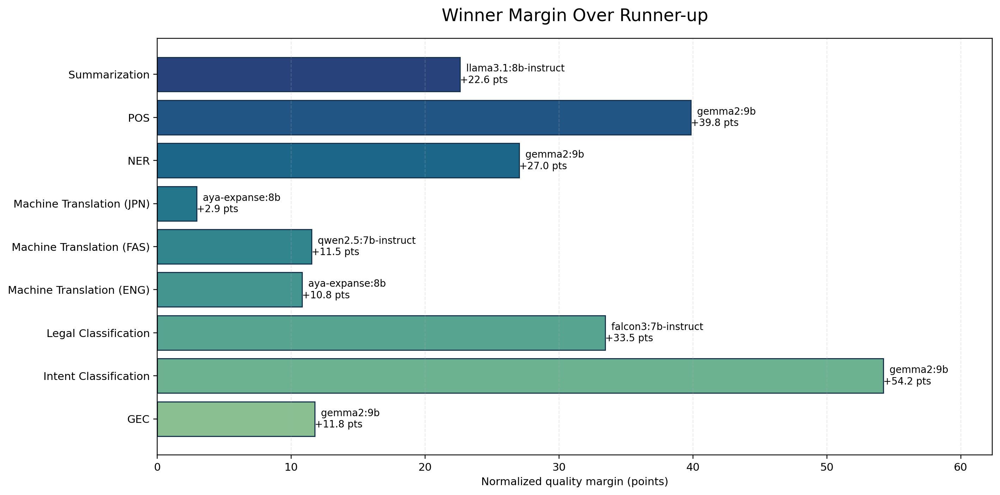
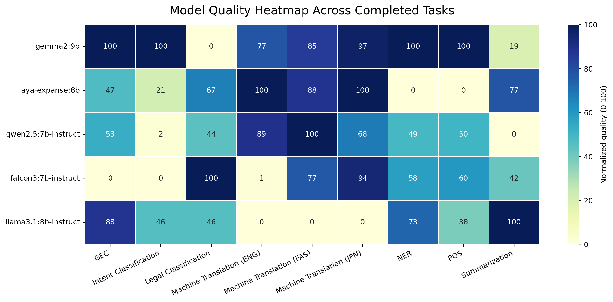
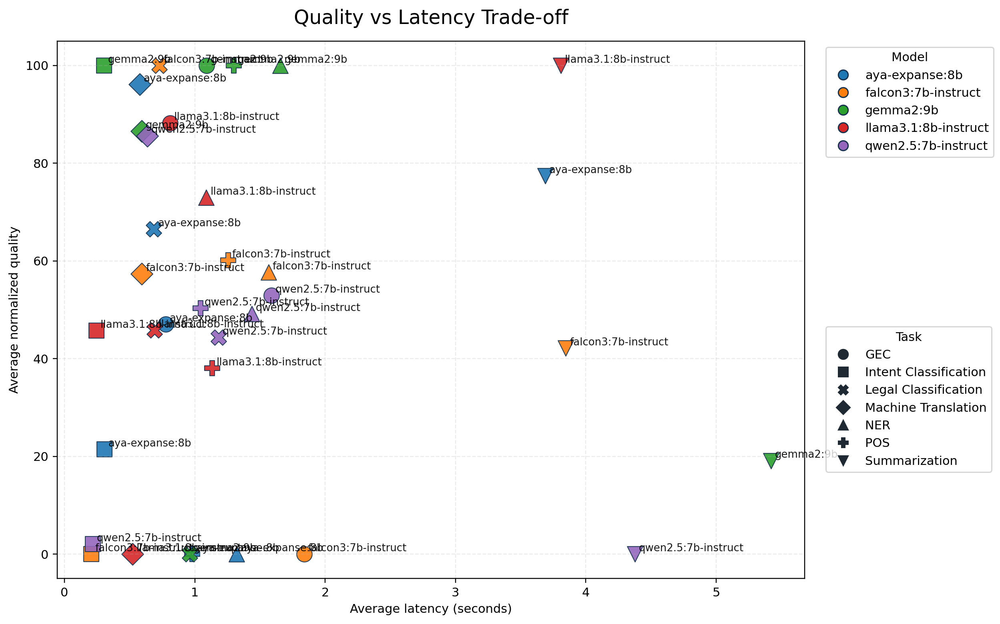

# Full Benchmark Report

This report summarizes the benchmark run captured in `results/server_runs/20260326_235652_full_suite_default_models_sample100_volume_labels/`.

## Run Status

- Completed task segments: `GEC`, `Intent Classification`, `Legal Classification`, `Machine Translation (ENG)`, `Machine Translation (FAS)`, `Machine Translation (JPN)`, `NER`, `POS`, `Summarization`
- Incomplete tasks: none

## Overall Model Ranking

| rank | model | tasks_completed | avg_normalized_quality | median_normalized_quality | avg_latency_seconds |
| --- | --- | --- | --- | --- | --- |
| 1 | gemma2:9b | 9 | 75.429 | 97.059 | 1.390 |
| 2 | aya-expanse:8b | 9 | 55.661 | 66.542 | 1.054 |
| 3 | qwen2.5:7b-instruct | 9 | 50.635 | 50.336 | 1.305 |
| 4 | falcon3:7b-instruct | 9 | 48.004 | 57.656 | 1.246 |
| 5 | llama3.1:8b-instruct | 9 | 43.421 | 45.771 | 1.038 |

## Best Model Per Task Segment

| task_segment | primary_metric | winner | winner_value | winner_quality_score | runner_up | runner_up_value | runner_up_quality_score | quality_margin | margin | fastest_model | fastest_latency_seconds | samples | note |
| --- | --- | --- | --- | --- | --- | --- | --- | --- | --- | --- | --- | --- | --- |
| GEC | exact_match | gemma2:9b | 0.170 | 100.000 | llama3.1:8b-instruct | 0.150 | 88.235 | 11.765 | 0.020 | aya-expanse:8b | 0.776 | 100 |  |
| Intent Classification | macro_f1 | gemma2:9b | 0.847 | 100.000 | llama3.1:8b-instruct | 0.701 | 45.771 | 54.229 | 0.146 | falcon3:7b-instruct | 0.204 | 100 |  |
| Legal Classification | macro_f1 | falcon3:7b-instruct | 0.010 | 100.000 | aya-expanse:8b | 0.008 | 66.542 | 33.458 | 0.002 | aya-expanse:8b | 0.686 | 100 | Winner was within 10% of the fastest model. |
| Machine Translation (ENG) | wer_vs_reference | aya-expanse:8b | 54.688 | 100.000 | qwen2.5:7b-instruct | 58.656 | 89.191 | 10.809 | 3.968 | qwen2.5:7b-instruct | 0.471 | 87 |  |
| Machine Translation (FAS) | wer_vs_reference | qwen2.5:7b-instruct | 104.770 | 100.000 | aya-expanse:8b | 111.126 | 88.477 | 11.523 | 6.357 | falcon3:7b-instruct | 0.442 | 4 |  |
| Machine Translation (JPN) | wer_vs_reference | aya-expanse:8b | 133.333 | 100.000 | gemma2:9b | 144.444 | 97.059 | 2.941 | 11.111 | qwen2.5:7b-instruct | 0.548 | 9 |  |
| NER | macro_f1 | gemma2:9b | 0.109 | 100.000 | llama3.1:8b-instruct | 0.099 | 72.970 | 27.030 | 0.010 | llama3.1:8b-instruct | 1.088 | 100 |  |
| POS | macro_f1 | gemma2:9b | 0.469 | 100.000 | falcon3:7b-instruct | 0.353 | 60.154 | 39.846 | 0.116 | aya-expanse:8b | 0.981 | 100 |  |
| Summarization | wer_vs_reference | llama3.1:8b-instruct | 189.061 | 100.000 | aya-expanse:8b | 243.162 | 77.391 | 22.609 | 54.100 | aya-expanse:8b | 3.688 | 100 | Winner was within 10% of the fastest model. |

## Diagrams

## Takeaways

- `gemma2:9b` ranks first overall on the normalized quality aggregate for this run.
- Legal classification is now coarse-grained (`Volume N` labels), which avoids the previous all-zero opaque-ID setup, though the task remains difficult.
- POS tagging completed after switching the UD loader to a parser that tolerates `_` head values in the CoNLL-U files.
- Summarization remains the slowest task family in this sample and is currently scored with edit-distance metrics in the summary table.
