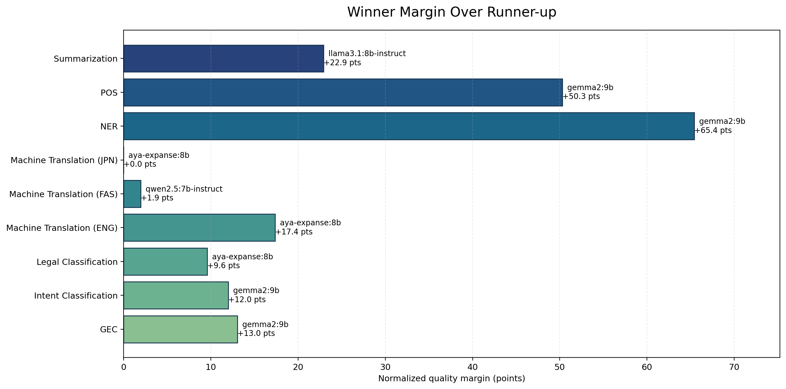
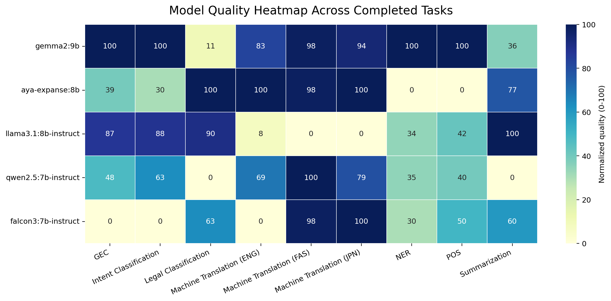
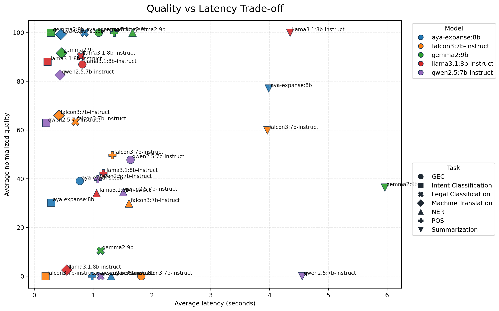

# Full Benchmark Report

This report summarizes the benchmark run captured in `results/server_runs/completed_runs/20260327_234711_full_suite_default_models_capped_test_reasonable/`.

## Run Status

- Completed task segments: `GEC`, `Intent Classification`, `Legal Classification`, `Machine Translation (ENG)`, `Machine Translation (FAS)`, `Machine Translation (JPN)`, `NER`, `POS`, `Summarization`
- Incomplete tasks: none

## Overall Model Ranking

| rank | model | tasks_completed | avg_normalized_quality | median_normalized_quality | avg_latency_seconds |
| --- | --- | --- | --- | --- | --- |
| 1 | gemma2:9b | 9 | 80.199 | 98.058 | 1.431 |
| 2 | aya-expanse:8b | 9 | 60.496 | 77.073 | 1.060 |
| 3 | llama3.1:8b-instruct | 9 | 49.943 | 42.250 | 1.118 |
| 4 | qwen2.5:7b-instruct | 9 | 48.113 | 47.826 | 1.268 |
| 5 | falcon3:7b-instruct | 9 | 44.545 | 49.698 | 1.206 |

## Best Model Per Task Segment

| task_segment | primary_metric | winner | winner_value | winner_quality_score | runner_up | runner_up_value | runner_up_quality_score | quality_margin | margin | fastest_model | fastest_latency_seconds | samples | note |
| --- | --- | --- | --- | --- | --- | --- | --- | --- | --- | --- | --- | --- | --- |
| GEC | exact_match | gemma2:9b | 0.137 | 100.000 | llama3.1:8b-instruct | 0.120 | 86.957 | 13.043 | 0.017 | aya-expanse:8b | 0.772 | 175 |  |
| Intent Classification | macro_f1 | gemma2:9b | 0.737 | 100.000 | llama3.1:8b-instruct | 0.707 | 88.017 | 11.983 | 0.030 | falcon3:7b-instruct | 0.189 | 436 |  |
| Legal Classification | macro_f1 | aya-expanse:8b | 0.011 | 100.000 | llama3.1:8b-instruct | 0.010 | 90.428 | 9.572 | 0.001 | falcon3:7b-instruct | 0.696 | 500 |  |
| Machine Translation (ENG) | wer_vs_reference | aya-expanse:8b | 55.642 | 100.000 | gemma2:9b | 60.736 | 82.650 | 17.350 | 5.094 | falcon3:7b-instruct | 0.420 | 300 |  |
| Machine Translation (FAS) | wer_vs_reference | qwen2.5:7b-instruct | 86.345 | 100.000 | falcon3:7b-instruct | 98.529 | 98.058 | 1.942 | 12.185 | falcon3:7b-instruct | 0.290 | 4 |  |
| Machine Translation (JPN) | wer_vs_reference | aya-expanse:8b | 100.000 | 100.000 | falcon3:7b-instruct | 100.000 | 100.000 | 0.000 | 0.000 | gemma2:9b | 0.456 | 9 | Winner was within 10% of the fastest model. |
| NER | macro_f1 | gemma2:9b | 0.122 | 100.000 | qwen2.5:7b-instruct | 0.095 | 34.561 | 65.439 | 0.027 | llama3.1:8b-instruct | 1.057 | 500 |  |
| POS | macro_f1 | gemma2:9b | 0.486 | 100.000 | falcon3:7b-instruct | 0.332 | 49.698 | 50.302 | 0.154 | aya-expanse:8b | 0.983 | 456 |  |
| Summarization | wer_vs_reference | llama3.1:8b-instruct | 173.585 | 100.000 | aya-expanse:8b | 208.784 | 77.073 | 22.927 | 35.199 | falcon3:7b-instruct | 3.962 | 300 | Winner was within 10% of the fastest model. |

## Diagrams

## Takeaways

- `gemma2:9b` ranks first overall on the normalized quality aggregate for this run.
- Legal classification is now coarse-grained (`Volume N` labels), which avoids the previous all-zero opaque-ID setup, though the task remains difficult.
- POS tagging completed after switching the UD loader to a parser that tolerates `_` head values in the CoNLL-U files.
- Summarization remains the slowest task family in this sample and is currently scored with edit-distance metrics in the summary table.
