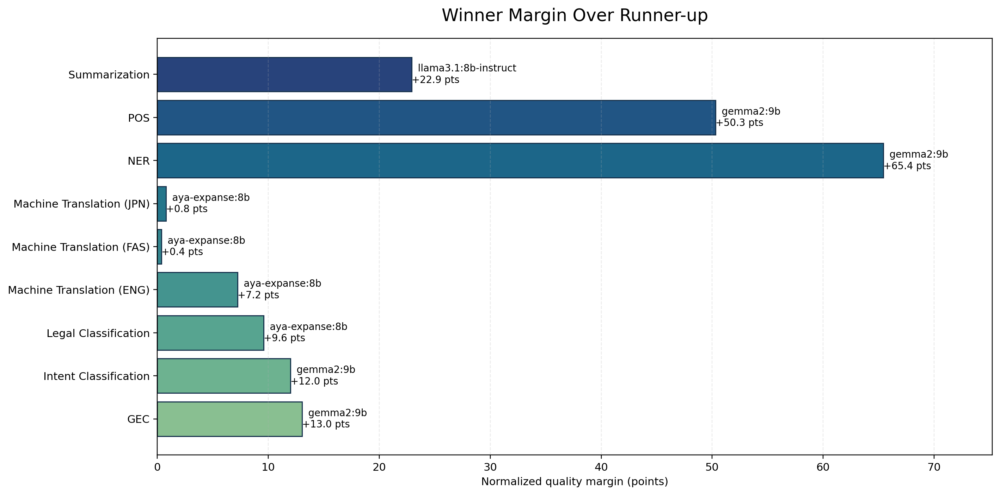
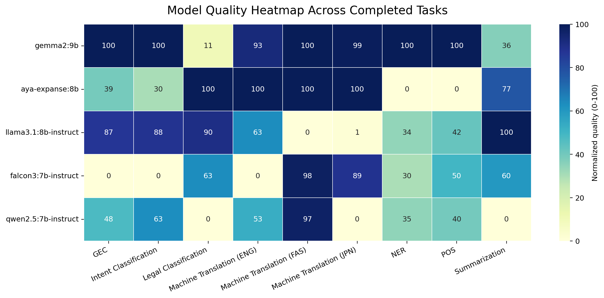
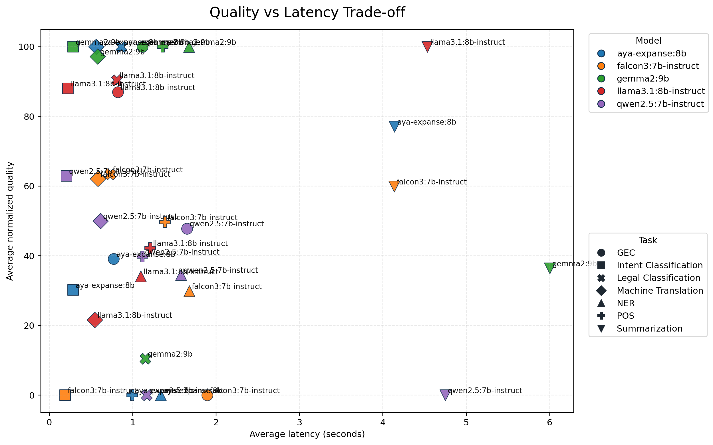

# Full Benchmark Report

This report summarizes the benchmark run captured in `results/server_runs/completed_runs/20260328_182745_full_suite_default_models_capped500/`.

## Run Status

- Completed task segments: `GEC`, `Intent Classification`, `Legal Classification`, `Machine Translation (ENG)`, `Machine Translation (FAS)`, `Machine Translation (JPN)`, `NER`, `POS`, `Summarization`
- Incomplete tasks: none

## Overall Model Ranking

| rank | model | tasks_completed | avg_normalized_quality | median_normalized_quality | avg_latency_seconds |
| --- | --- | --- | --- | --- | --- |
| 1 | gemma2:9b | 9 | 82.066 | 99.638 | 1.480 |
| 2 | aya-expanse:8b | 9 | 60.712 | 77.073 | 1.120 |
| 3 | llama3.1:8b-instruct | 9 | 56.285 | 63.434 | 1.148 |
| 4 | falcon3:7b-instruct | 9 | 43.239 | 49.698 | 1.306 |
| 5 | qwen2.5:7b-instruct | 9 | 37.227 | 39.769 | 1.368 |

## Best Model Per Task Segment

| task_segment | primary_metric | winner | winner_value | winner_quality_score | runner_up | runner_up_value | runner_up_quality_score | quality_margin | margin | fastest_model | fastest_latency_seconds | samples | note |
| --- | --- | --- | --- | --- | --- | --- | --- | --- | --- | --- | --- | --- | --- |
| GEC | exact_match | gemma2:9b | 0.137 | 100.000 | llama3.1:8b-instruct | 0.120 | 86.957 | 13.043 | 0.017 | aya-expanse:8b | 0.772 | 175 |  |
| Intent Classification | macro_f1 | gemma2:9b | 0.737 | 100.000 | llama3.1:8b-instruct | 0.707 | 88.017 | 11.983 | 0.030 | falcon3:7b-instruct | 0.188 | 436 |  |
| Legal Classification | macro_f1 | aya-expanse:8b | 0.011 | 100.000 | llama3.1:8b-instruct | 0.010 | 90.428 | 9.572 | 0.001 | falcon3:7b-instruct | 0.730 | 500 |  |
| Machine Translation (ENG) | wer_vs_reference | aya-expanse:8b | 56.359 | 100.000 | gemma2:9b | 57.915 | 92.780 | 7.220 | 1.556 | falcon3:7b-instruct | 0.431 | 500 |  |
| Machine Translation (FAS) | wer_vs_reference | aya-expanse:8b | 109.222 | 100.000 | gemma2:9b | 110.071 | 99.638 | 0.362 | 0.849 | falcon3:7b-instruct | 0.416 | 500 |  |
| Machine Translation (JPN) | wer_vs_reference | aya-expanse:8b | 109.067 | 100.000 | gemma2:9b | 109.538 | 99.213 | 0.787 | 0.471 | qwen2.5:7b-instruct | 0.558 | 500 | Winner was within 10% of the fastest model. |
| NER | macro_f1 | gemma2:9b | 0.122 | 100.000 | qwen2.5:7b-instruct | 0.095 | 34.561 | 65.439 | 0.027 | llama3.1:8b-instruct | 1.097 | 500 |  |
| POS | macro_f1 | gemma2:9b | 0.486 | 100.000 | falcon3:7b-instruct | 0.332 | 49.698 | 50.302 | 0.154 | aya-expanse:8b | 0.993 | 456 |  |
| Summarization | wer_vs_reference | llama3.1:8b-instruct | 173.585 | 100.000 | aya-expanse:8b | 208.784 | 77.073 | 22.927 | 35.199 | falcon3:7b-instruct | 4.135 | 300 | Winner was within 10% of the fastest model. |

## Diagrams

## Takeaways

- `gemma2:9b` ranks first overall on the normalized quality aggregate for this run.
- Legal classification is now coarse-grained (`Volume N` labels), which avoids the previous all-zero opaque-ID setup, though the task remains difficult.
- POS tagging completed after switching the UD loader to a parser that tolerates `_` head values in the CoNLL-U files.
- Summarization remains the slowest task family in this sample and is currently scored with edit-distance metrics in the summary table.
