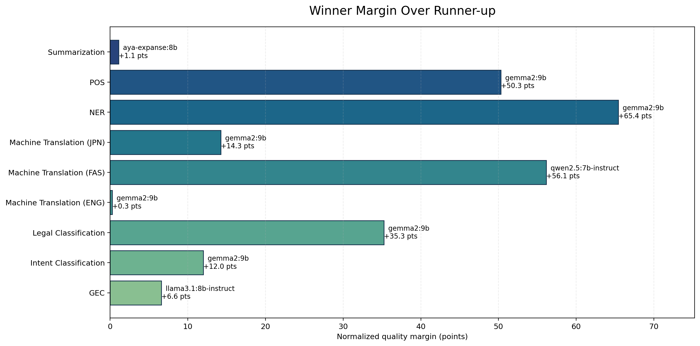
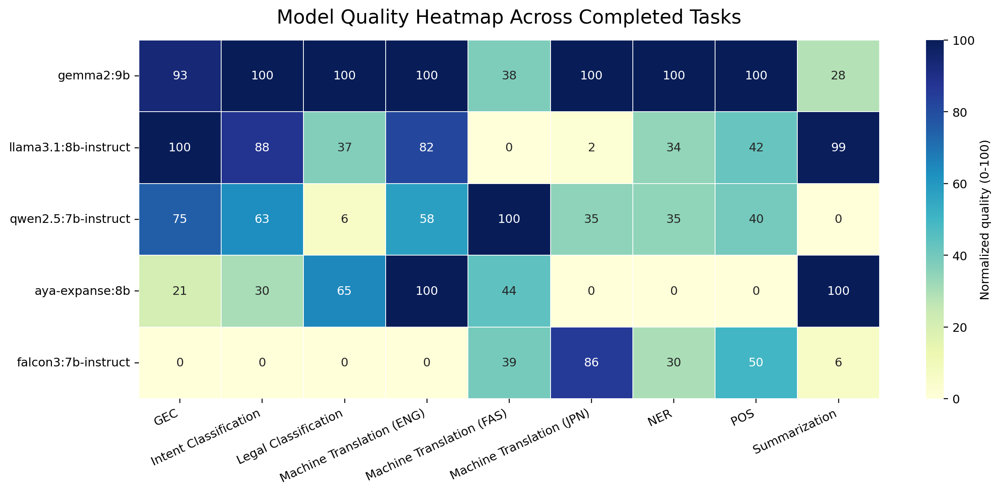
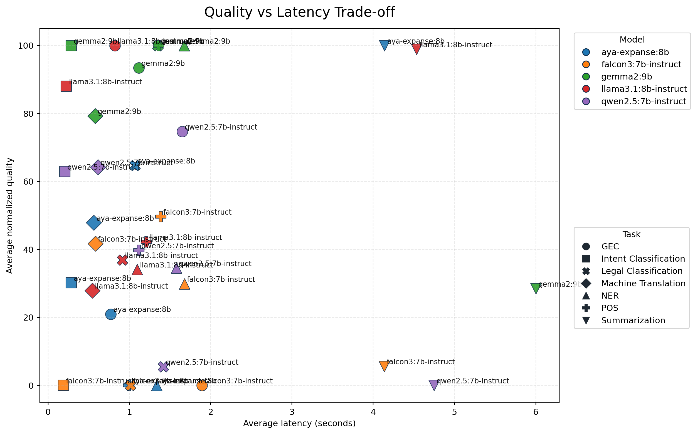

# Full Benchmark Report

This report summarizes the benchmark run captured in `results/server_runs/completed_runs/20260410_legaldata_refresh_full_suite_default_models_capped500/`.

## Run Status

- Completed task segments: `GEC`, `Intent Classification`, `Legal Classification`, `Machine Translation (ENG)`, `Machine Translation (FAS)`, `Machine Translation (JPN)`, `NER`, `POS`, `Summarization`
- Incomplete tasks: none

## Overall Model Ranking

| rank | model | tasks_completed | avg_normalized_quality | median_normalized_quality | avg_latency_seconds |
| --- | --- | --- | --- | --- | --- |
| 1 | gemma2:9b | 9 | 84.408 | 100.000 | 1.502 |
| 2 | llama3.1:8b-instruct | 9 | 53.786 | 42.250 | 1.159 |
| 3 | qwen2.5:7b-instruct | 9 | 45.569 | 39.769 | 1.395 |
| 4 | aya-expanse:8b | 9 | 39.948 | 30.201 | 1.143 |
| 5 | falcon3:7b-instruct | 9 | 23.370 | 5.618 | 1.337 |

## Best Model Per Task Segment

| task_segment | primary_metric | winner | winner_value | winner_quality_score | runner_up | runner_up_value | runner_up_quality_score | quality_margin | margin | fastest_model | fastest_latency_seconds | samples | note |
| --- | --- | --- | --- | --- | --- | --- | --- | --- | --- | --- | --- | --- | --- |
| GEC | gleu_vs_reference | llama3.1:8b-instruct | 0.796 | 100.000 | gemma2:9b | 0.784 | 93.392 | 6.608 | 0.012 | aya-expanse:8b | 0.772 | 175 | Winner was within 10% of the fastest model. |
| Intent Classification | macro_f1 | gemma2:9b | 0.737 | 100.000 | llama3.1:8b-instruct | 0.707 | 88.017 | 11.983 | 0.030 | falcon3:7b-instruct | 0.188 | 436 |  |
| Legal Classification | macro_f1 | gemma2:9b | 0.126 | 100.000 | aya-expanse:8b | 0.098 | 64.745 | 35.255 | 0.028 | llama3.1:8b-instruct | 0.914 | 500 |  |
| Machine Translation (ENG) | bleu | gemma2:9b | 35.073 | 100.000 | aya-expanse:8b | 35.037 | 99.737 | 0.263 | 0.036 | falcon3:7b-instruct | 0.431 | 500 |  |
| Machine Translation (FAS) | bleu | qwen2.5:7b-instruct | 4.183 | 100.000 | aya-expanse:8b | 2.146 | 43.853 | 56.147 | 2.037 | falcon3:7b-instruct | 0.416 | 500 |  |
| Machine Translation (JPN) | bleu | gemma2:9b | 6.227 | 100.000 | falcon3:7b-instruct | 5.665 | 85.749 | 14.251 | 0.563 | qwen2.5:7b-instruct | 0.558 | 500 |  |
| NER | macro_f1 | gemma2:9b | 0.122 | 100.000 | qwen2.5:7b-instruct | 0.095 | 34.561 | 65.439 | 0.027 | llama3.1:8b-instruct | 1.097 | 500 |  |
| POS | macro_f1 | gemma2:9b | 0.486 | 100.000 | falcon3:7b-instruct | 0.332 | 49.698 | 50.302 | 0.154 | aya-expanse:8b | 0.993 | 456 |  |
| Summarization | bertscore_f1 | aya-expanse:8b | 0.519 | 100.000 | llama3.1:8b-instruct | 0.517 | 98.914 | 1.086 | 0.002 | falcon3:7b-instruct | 4.135 | 300 | Winner was within 10% of the fastest model. |

## Diagrams

## Takeaways

- `gemma2:9b` ranks first overall on the normalized quality aggregate for this run.
- Legal classification is now coarse-grained (`Volume N` labels), which avoids the previous all-zero opaque-ID setup, though the task remains difficult.
- POS tagging completed after switching the UD loader to a parser that tolerates `_` head values in the CoNLL-U files.
- Summarization remains the slowest task family in this sample and is currently scored with edit-distance metrics in the summary table.
