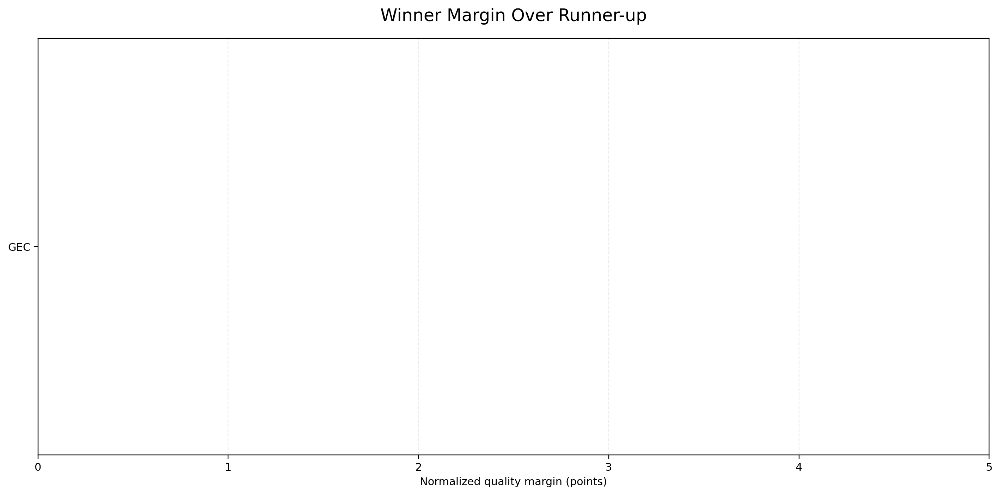
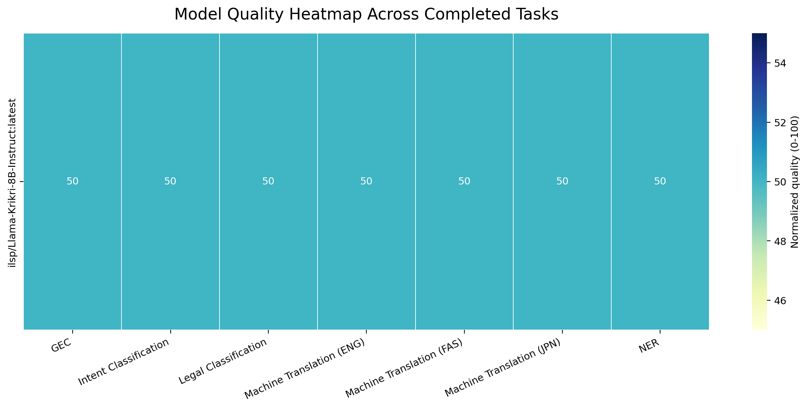
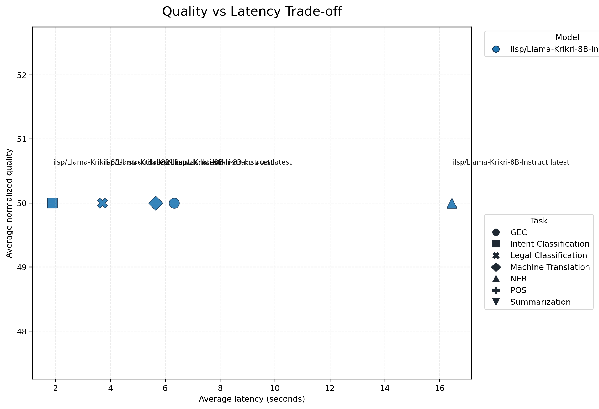

# Full Benchmark Report

This report summarizes the benchmark run captured in `results/server_runs/krikri_fulltest/`.

## Run Status

- Completed task segments: `GEC`, `Intent Classification`, `Legal Classification`, `Machine Translation (ENG)`, `Machine Translation (FAS)`, `Machine Translation (JPN)`, `NER`
- Incomplete tasks: none

## Overall Model Ranking

| rank | model | tasks_completed | avg_normalized_quality | median_normalized_quality | avg_latency_seconds |
| --- | --- | --- | --- | --- | --- |
| 1 | ilsp/Llama-Krikri-8B-Instruct:latest | 7 | 50.000 | 50.000 | 6.473 |

## Best Model Per Task Segment

| task_segment | primary_metric | winner | winner_value | winner_quality_score | runner_up | runner_up_value | runner_up_quality_score | quality_margin | margin | fastest_model | fastest_latency_seconds | samples | note |
| --- | --- | --- | --- | --- | --- | --- | --- | --- | --- | --- | --- | --- | --- |
| GEC | gleu_vs_reference | ilsp/Llama-Krikri-8B-Instruct:latest | 0.593 | 50.000 |  |  |  |  |  | ilsp/Llama-Krikri-8B-Instruct:latest | 6.330 | 175 | Winner also had the fastest average latency. |
| Intent Classification | macro_f1 | ilsp/Llama-Krikri-8B-Instruct:latest | 0.324 | 50.000 |  |  |  |  |  | ilsp/Llama-Krikri-8B-Instruct:latest | 1.885 | 436 | Winner also had the fastest average latency. |
| Legal Classification | macro_f1 | ilsp/Llama-Krikri-8B-Instruct:latest | 0.156 | 50.000 |  |  |  |  |  | ilsp/Llama-Krikri-8B-Instruct:latest | 3.707 | 500 | Winner also had the fastest average latency. |
| Machine Translation (ENG) | bleu | ilsp/Llama-Krikri-8B-Instruct:latest | 34.872 | 50.000 |  |  |  |  |  | ilsp/Llama-Krikri-8B-Instruct:latest | 4.718 | 500 | Winner also had the fastest average latency. |
| Machine Translation (FAS) | bleu | ilsp/Llama-Krikri-8B-Instruct:latest | 2.026 | 50.000 |  |  |  |  |  | ilsp/Llama-Krikri-8B-Instruct:latest | 5.300 | 500 | Winner also had the fastest average latency. |
| Machine Translation (JPN) | bleu | ilsp/Llama-Krikri-8B-Instruct:latest | 2.448 | 50.000 |  |  |  |  |  | ilsp/Llama-Krikri-8B-Instruct:latest | 6.930 | 500 | Winner also had the fastest average latency. |
| NER | macro_f1 | ilsp/Llama-Krikri-8B-Instruct:latest | 0.093 | 50.000 |  |  |  |  |  | ilsp/Llama-Krikri-8B-Instruct:latest | 16.443 | 500 | Winner also had the fastest average latency. |

## Diagrams

## Takeaways

- `ilsp/Llama-Krikri-8B-Instruct:latest` ranks first overall on the normalized quality aggregate for this run.
- Legal classification is now coarse-grained (`Volume N` labels), which avoids the previous all-zero opaque-ID setup, though the task remains difficult.
